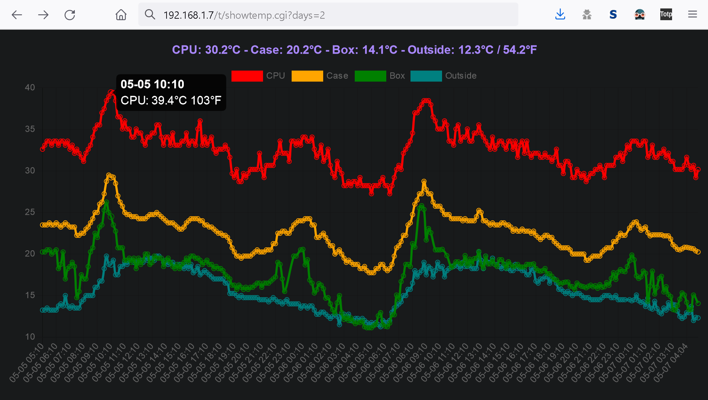

## rpi-ds18b20 (rev.20230510)
### Log multiple DS18B20 one-wire temperature sensors from a Raspberry Pi to a graph on a web server. 

The goal of this project is to make it quick and easy to regularly log temperature sensors from a Raspberry Pi and send the readings to a web server, where the readings can be viewed as a lines chart with a web browser. 

The same RPi can be the web server, and multiple RPis can send data to the same server.

#### HOW IT WORKS
On the RPi side:
- The main shell script (logtemp.sh) is called regularly by a cron job and logs the temperature from multiple sensors, then sends the data to another server using Curl.

On the web server side:
- Two perl scripts are used. One script (logtemp.cgi) receives the data and saves it to a log whenever the RPi sends it.
- The other (showtemp.cgi) processes the log and outputs a web page to display the data in a chart using javascript (Chart.js).

#### REQUIREMENTS
On the RPi side:
- One-wire must be enabled, typically in the "/boot/config.txt" file or by using the 'raspi-config' command,
  (see the rpi-1wire-help.txt for more details).
- The cron service (or equivalent) must be running to regularly collect sensor data,
  (cron can be installed with the 'apt install cron' command).
- Curl (or wget, by adapting the script) must be installed/available,
  (Curl can be installed with the 'apt install curl' command).

On the web server side:
- Perl, which is usually installed by default (tested with Perl v5.20.2 but should work with other versions)
- Apache or any web server able to run CGI scripts (tested with Apache 2.4.10 raspbian)
  (Apache2 can be installed with the 'apt install apache2' command)

#### INSTALLATION
On the RPi side:
- Copy the script from "opt/rpi-ds18b20/logtemp.sh" to "/opt/rpi-ds18b20/".
- Make the script executable with 'chmod 755 logtemp.sh'.
- Edit "logtemp.sh" and put the unique IDs of your DS18B20 sensors and set the correct URL for your server.
    (you can find the ID of your sensors with the command "ls /sys/devices/w1_master/w1_master_slave")
- Copy the cron job from "etc/cron.d/rpi-ds18b20" to "/etc/cron.d/".
- Check with 'systemctl status cron' that the cron service is enabled and running.
    If not, use the commands 'systemctl enable cron' and 'systemctl start cron'.

On the web server side:
- Copy the "var/www/html/t" directory to "/var/www/html/t".
- Set the permission of "t/logtemp.cgi" and "t/showtemp.cgi" to "755".
- Set the ownership of the "t" directory and all the files in it to "www" with 'chown -R www:www /var/www/t',
    (some server configs have a different user than "www", double-check with 'ls -l /var/www/html' to find the owner and group names used by your web server).

#### USAGE
- Point your web browser to the script on the server, e.g. "http://192.168.1.7/showtemp.cgi".
  * It will show a graph with all the data points from the last 24 hours.
- To limit the graph to a number of days and/or hours, add one or both parameters to the URL, e.g. 
  * "http://192.168.1.7/showtemp.cgi?days=2&hours=12".
  * It will show a graph with all the data points from the last 2 days and 12 hours.
  * The input is flexible enough to allow values such as "hours=48" instead of "days=2", or "days=0.5" instead of "hours=12".
- Hover the mouse (or hold your finger/stylus) over any point to see the time/temperature of that point.
- To refresh the graph, reload the page. I could add automatic refreshing if anyone requests it.

#### DETAILS
Between the temperature sensors and the graph in the web browser are four scripts:
- "rpi-ds18b20", the cron schedule on the RPi which periodically calls "logtemp.sh"
- "logtemp.sh", the shell script on the RPi which logs the temperature data and calls "logtemp.cgi" to send it to the server
- "logtemp.cgi", the Perl script on the web server which logs the data coming from the RPi
- "showtemp.cgi", the Perl script on the web server which generates the web page to display the charts

Cron job (/etc/cron.d/rpi-ds18b20)
- The cron job can be run as frequently or rarely as desired, from every minute to once a month. 
- The default is every 10 minutes, which seems like a good compromise because it provides enough datapoints for typically slow environmental changes, while growing the log file by less than 10KB per day.
- If you prefer to keep all the cron jobs together in the "/etc/crontab" file, just copy the schedule from the "ds18b20" file.
- If you would like to change the interval between temperature readings and need help with the cron scheduling syntax, see http://cron.help
- If you change the interval, the "$minutes" variable in the "showtemp.cgi" script on the web server should be adjusted accordingly, so that the script can calculate the right number of datapoints per day and hour. 

Temperature logging (/opt/rpi-ds18b20/logtemp.sh)
- The "logtemp.sh" script reads the temperature from the CPU and 3 DS18B20 sensors. 
- As the sensors configuration rarely changes if at all, the sensors count, IDs and descriptions are hard-coded, keeping the code short and simple, but the scripts can easily be changed to accomodate any number of sensors. 
- If a sensor returns an invalid value, the script will attempt to reset the sensor and retry reading the value once. 
- It will also log the error to provide an easier way to analyze recurring sensor failures. 
- If it fails on the second try, it will log "-" as the temperature for that sensor (so that the chart can skip the invalid data point without disturbing the display of valid ones).
- Finally, the temperatures read are sent to the "logtemp.cgi" script on web server, with the 4 temperature values as parameters.
- If the "logtemp.sh" script is moved to a different location, edit the script to set the "LOGPATH" variable to a valid path for the logs, and edit the cron job to point to the correct path for the "logtemp.sh" script.

Server-side logging (/var/www/html/t/logtemp.cgi)
- The default path for the "logtemp.cgi" script is "t", but it could be placed anywhere.
- If the script is placed in a different directory, e.g. "/var/www/cgi-bin", make sure to adjust the "URL" variable accordingly in the "logtemp.sh" script on the RPi.
- By default the log is saved to the same directory as the script, but can be changed by editing the "$logfile" variables in BOTH the "logtemp.cgi" AND "showtemp.cgi" scripts.

Server-side chart display (/var/www/html/t/showtemp.cgi)
- The default path for the "showtemp.cgi" script is "t", but it could be placed anywhere.
- The "user variables" section at the begining of the script can be edited to customize the sensor descriptions on the chart.

#### USING THE SAME RPI FOR BOTH THE SENSORS AND WEB SERVER
Since the log created on the web server is identical to the one on the RPi, the 'curl' command in "logtemp.sh" can be commented out, and the log can be saved directly to the directory where "showtemp.cgi" is located. In that case, 'curl' and "logtemp.cgi" are not needed.

#### MORE SENSORS, MORE RPIs
It is possible to display any number of sensors from any number of sources, see the "examples" directory for details.

